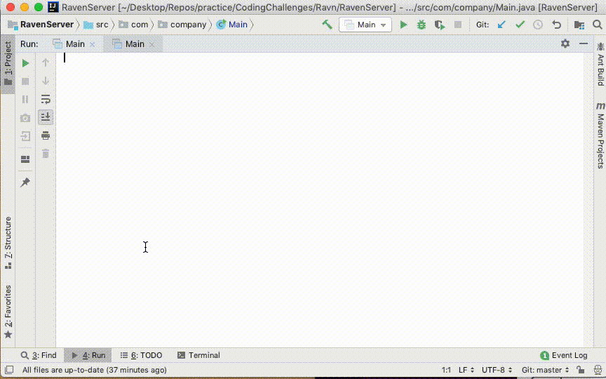
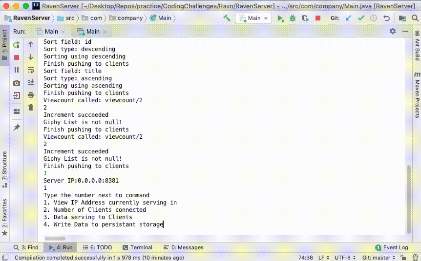

# Ravn Coding Challenge

__Prompt__ - Build a client-server app using Android and a simple Java app
 without using HTTP messanging frameworks. The use of Java sockets, 0MQ, or 
 JeroMQ is permitted. Multiple clients should be able to connect to the same 
 server. Implement calls: LIST, ADD, REMOVE, UPDATE, and SORT

__Implementation__ 
1. One Android app
2. One Java console app using IntelliJ
3. Java Sockets. 
4. GSON Library to serialize the JSONs
5. Glide Library to cache GIF's from the internet.

__Not Implemented__ 
1. UDP discovery mechanism. User will have to manually type
the IP address of their local machine.
2. Detail and Thumbnails for the media.

## 1. Starting the Server

1. git pull https://github.com/ravn-code-challenge/RavenServer
2. Open in IntelliJ and Run

## 2. Connecting the Client

1. git pull https://github.com/ravn-code-challenge/RavnAndroidClient
2. Open in Android Studio and Run
3. Open Navigation Drawer
4. Press Connect
5. Input the IP your Server is serving on (Local Machine's IP)
6. Press List to see the media from Server

## 3. Adding GIF's
1. Open Nav Drawer and press Add
2. Input title, author, and Giphy Address (https://media.giphy.com/media/AqfOVseMPDVja/giphy.gif)
3. Press Add
(Will be pushed to all other clients) 

## 4. Updating/Removing GIF's

1. Click on gif from main list
2. Make changes and update or Remove

## 5. Sorting GIF's

1. Open Nav Drawer and press Sort
2. Pick which field to sort on
3. Pick the type of sort
4. Press sort

## 6. Writing Changes to Persistance Storage

1. In Server Console, type 4

## Contributing
This was a coding challenge issued from Ravn on 5/1/2019 for the position Android Engineer. There will be no more contribution to this project after 5/5/19

## License
[MIT](https://choosealicense.com/licenses/mit/)